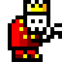
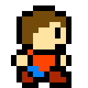
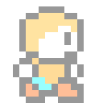
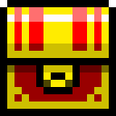

# Don'tLetMeClear!

## コンセプト

mouja(敵キャラ)を操作し、playerから宝箱を守るゲーム。**playerが宝箱に触れる** or **moujaのHPゲージが零になる**と、ゲームオーバーとなる。**全てのplayerを倒す**とゲームクリアとなる。

## mouja

火を吐いたり、とび道具を投げつけて、playerを攻撃できる。(体当たりが強い。)

## player

基本的に宝箱を目指して移動を続けるが、二つの状態が存在する。

### 通常状態

とび道具を投げつけて、moujaを攻撃してくる。**moujaの攻撃を受けると、宝箱から遠ざかるようにノックバックする。**

### 無敵状態

ゲーム開始時にランダムでこの状態になる。moujaの攻撃を一切受け付けない。moujaに触れると一撃で倒すことができる。一定時間経過で、解除される。

### takara

ゴールの宝箱。ステージの真ん中に置かれる事もある。

## その他仕様

- playerはマウスにタッチされると、動きが制限される。
- playerがmoujaに触れると、互にダメージを受ける。**この際、playerの方が多くダメージを受ける。**
- とび道具同士は、相殺する。

## 操作方法

## 素材

- [音楽：MaouDamashii](https://maou.audio/)
- [画像：『楽しく学ぶ　Unity2D超入門講座』](https://book.mynavi.jp/supportsite/detail/9784839966768.html)

## 実行ファイル

- [Don'tLetMeClear(zip)](https://drive.google.com/drive/folders/12U_5LvD-hmGvs9YVVtifUJ0qhOUA9_L9?usp=sharing)
